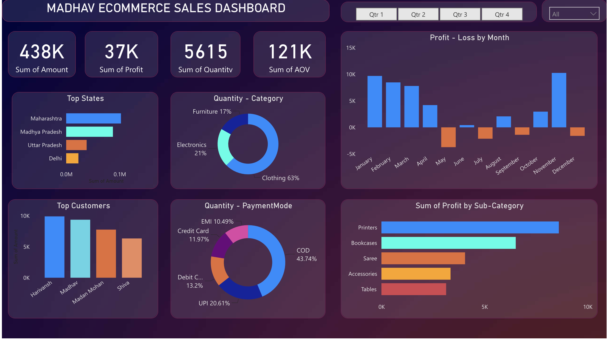

# ProfitLens-Analytics
Interactive Power BI dashboard analyzing e-commerce sales, profit, customer trends, and business performance using cleaned transactional data.
# 📊 Madhav Ecommerce Sales Dashboard (Power BI)

## 📌 Project Overview
This project is a Power BI dashboard built to analyze Madhav Ecommerce sales data. It provides insights into sales performance, profit trends, customer behavior, and category-wise analysis.

## 🛠 Tools Used
- Power BI Desktop  
- Power Query  
- DAX  
- Excel / CSV Dataset  

## 📁 Files in Repository
- Orders.csv → Contains order details data  
- Details.csv → Contains product/category details  
- Madhav Store ECommerce Project.pbix → Power BI dashboard file
- Dashboard.png → Pwer BI dashboard image
- README.md → Project documentation  

## 📊 Key Dashboard Insights
- Total Sales, Profit, Quantity, and Average Order Value (AOV)
- Top 5 States by Sales
- Top Customers based on revenue
- Category-wise sales distribution
- Payment mode analysis
- Monthly profit trends
- Sub-category wise profit analysis

## 📈 Dashboard Features
- Interactive filters & slicers
- Drill-down analysis
- Dynamic charts (bar, pie, donut, line, area, map)
- Data-driven insights for business decision making

## 📷 Dashboard Preview

## 🎯 Objective
To analyze ecommerce data and help businesses understand sales performance and improve decision-making using visual analytics.

## 🚀 How to Use
1. Download the repository
2. Open `.pbix` file in Power BI Desktop
3. Explore visuals and filters

## 📌 Author
Shrijit Talwatkar

📧 Email: shrijittalwatkar@gmail.com

🔗 LinkedIn: http://www.linkedin.com/in/shrijit-talwatkar

🔗 GitHub: https://github.com/shrijit-talwatkar
